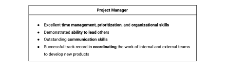
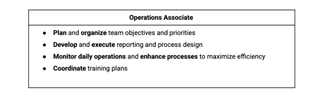

# Project Management

This Repo discus about the project management and the project management  methodologies. This Doc are taken from Google courses in Coursera. For more resources check this [link](https://www.coursera.org/learn/foundations-of-project-management-arabic)

[PDF](assets/README.pdf)

## An Overview of Project Management

### Project

- A unique endeavor, and usually includes a set of unique deliverable

- A temporary pursuit; it has a defined beginning and end

In other words, the project is series of tasks that need be completed to reach to desired outcome.

### Project Management

Project management is the application of knowledge, skills, tools and techniques to meet the project requirements and achieve the desired outcome.  

### Project Manager
Shaperd projects from start to finish and serve as guides for their team, using their impeccable origanizational and interperonal skills ever step of the way.

what project manager do ? 

- Planning and organizing 

- Managing tasks 

- Budgeting

- Controlling Cost and other factors

Also , project manager need to make sure that the project outcome is bringing value to the company. Project manager's responsibilities  depending on the project, the industry and the company they're working in. Their task will be different in each scenario.

### Planning

Kick off meetings or send survey. Also work on creating project planes.

### Managing Tasks

Once the project is is underway, the project manager helps manage the tasks for the team members and communicate key milestone to larger team or customers. That's help the team members and customers updated on how the project progressing.

### Managing Budgets

Budging and controlling the costs is a common responsibilities that the project managers have to to understand to keep the project on track.

### Project management as career

By the year 2027, the employers will need 87.7 million people filling project management aligned roles. Working on in industry  as project manager allow you to work in any different industry easily 

#### How to reach to project manager role ?

In project management, there's levels you have to pass before going to project manager role like project assistant. However,  how to gain experience in this field ? 

- internship:  The internship force you to know how to cooperate with team members, how the project is managing in  companies and working in tickets/tasks allow you to have a small knowledge how the process going.

- Contract work:  Not full-time job employee. You will work project-by-project . This concept describe the employee that work in different companies till the period of project end. Working on contract for  a company rather than being an official employee of a company allow you to gain experience how each company handle its own projects And discover the different type of companies and different projects.

**Project Manager Requirements:**

**Operations Accociate Requirements:**

### Value of project manager
Project managers add value to their teams and organizations in key ways that include:
* prioritization
* delegation
* effective communication

### Prioritization
Project managers add value of their teams and origanizations through effective prioritization of tasks required to complete a project. In a project , there're tasks with different levels of priority.